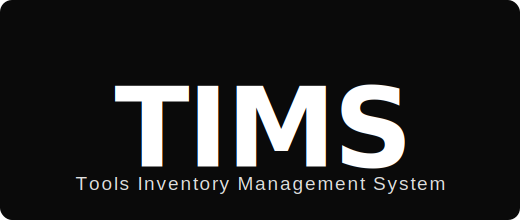

<div align="center">

<table border="0" cellspacing="0" cellpadding="0">
  <tr>
    <td align="center">
      
    </td>
    <td align="center" width="80">
      <h2>&nbsp;×&nbsp;</h2>
    </td>
    <td align="center">
      
    </td>
  </tr>
</table>

<br/>


<br/>

> **TIMS** is a production-ready, role-based tool inventory management system built for the Maintenance Department at **UltraTech Cement (Aditya Birla Group)**. It replaces Excel-based manual tracking with a structured, real-time system for issuing, returning, calibrating, and auditing plant maintenance tools.

<br/>

🌐 **Live:** [tims.riddhijayswal.com](https://tims.riddhijayswal.com) &nbsp;|&nbsp; 📖 **API Docs:** [tims.riddhijayswal.com/docs](https://tims.riddhijayswal.com/docs)

</div>

---

## Table of Contents

- [Overview](#overview)
- [Tech Stack](#tech-stack)
- [Quick Start](#quick-start)
- [Default Logins](#default-logins)
- [Roles & Permissions](#roles--permissions)
- [Features](#features)
- [Business Rules](#business-rules)
- [Project Structure](#project-structure)
- [Useful Commands](#useful-commands)
- [Deployment](#deployment)

---

## Overview

UltraTech Cement's Maintenance Department manages thousands of plant tools using paper registers and Excel. TIMS replaces this with a web-based, internet-accessible system that gives every role exactly what they need — nothing more, nothing less.

| Problem | TIMS Solution |
|---|---|
| No real-time stock visibility | Live available/issued counts per tool |
| Tools taken without authorisation | Mandatory requisition → approval → issue workflow |
| Calibration due dates missed | Background scheduler with auto-blocking |
| No damage or penalty tracking | Structured damage assessment with depreciated value |
| Physical location unknown | Storage bin management with occupancy tracking |
| No audit trail | Full audit log on every stock-modifying action |

---

## Tech Stack

| Layer | Technology | Purpose |
|---|---|---|
| Backend | FastAPI + SQLAlchemy + Alembic | REST API, ORM, schema migrations |
| Database | PostgreSQL 15 (Docker) | ACID-compliant inventory transactions |
| Auth | JWT bearer tokens + bcrypt | Role-based access, 8-hour session expiry |
| Scheduler | APScheduler | Daily calibration checks, overdue reminders |
| Frontend | React 18 (in-browser Babel) | SPA loaded via static file server |
| Design System | TIMS DS bundle (`_ds_bundle.js`) | Shared UI components across all screens |
| Containerisation | Docker Compose | Backend + Frontend + DB as unified stack |
| CI/CD | GitHub Actions → SSH deploy | Auto-deploy to Hetzner on push to `main` |

---

## Quick Start

### Prerequisites

- [Docker Desktop](https://www.docker.com/products/docker-desktop/) installed and running
- Git

### Run locally

```bash
git clone https://github.com/RiddhiJayswal/TIMS-Tool-Inventory-Management-System.git
cd TIMS-Tool-Inventory-Management-System

# Create local environment file
cp .env.example .env          # Linux / macOS
Copy-Item .env.example .env   # Windows PowerShell

# Build and start all services
docker compose up -d --build
```

| Service | URL |
|---|---|
| Frontend | http://localhost:3000 |
| Backend API | http://localhost:8000 |
| API Docs (Swagger) | http://localhost:8000/docs |

### Seed demo data

```bash
docker compose exec backend python seed.py
```

### Check containers

```bash
docker ps --format "table {{.Names}}\t{{.Status}}\t{{.Ports}}"
```

---

## Default Logins

All seed accounts use `password123` unless noted otherwise.

| Role | Employee ID | Department | Access Level |
|---|---|---|---|
| `maintenance_admin` | `ADM001` | Maintenance | Full system access |
| `maintenance_staff` | `STF001` | Maintenance | Issue, return, tools, bins, reports |
| `dept_head` | `HD001` | E&I | Approve own department requisitions |
| `requester` | `USR001` | E&I | Raise requests, view tools |

---

## Roles & Permissions

| Action | Admin | Staff | Dept Head | Requester |
|---|---|---|---|---|
| Login / logout | ✅ | ✅ | ✅ | ✅ |
| Forgot username / password | ✅ | ✅ | ✅ | ✅ |
| Request access (public) | ✅ | ✅ | ✅ | ✅ |
| Approve / reject access requests | ✅ | — | — | — |
| View tool catalogue | ✅ | ✅ | ✅ | ✅ |
| Add / edit / write off tools | ✅ | ✅ | — | — |
| Raise tool requisition | ✅ | ✅ | ✅ | ✅ |
| Approve requisitions | ✅ | — | Own dept only | — |
| Issue tools | ✅ | ✅ | — | — |
| Process returns | ✅ | ✅ | — | — |
| Damage assessment | ✅ | ✅ | — | — |
| Manage storage bins | ✅ | ✅ | — | — |
| Calibration schedule / history | ✅ | ✅ | — | — |
| Record calibration completion | ✅ | — | — | — |
| User management | ✅ | — | — | — |
| Reports & CSV exports | ✅ | ✅ | — | — |

> All role checks are enforced at the **API layer**. Frontend hides restricted routes, but backend returns HTTP 403 for any unauthorised attempt.

---

## Features

### Authentication & Access
- JWT-based login with role enforcement
- Inactive-user blocking at login
- Forgot username by registered email or employee ID
- Forgot password / reset token flow (token shown in UI when SMTP not configured)
- Public access-request form with admin approval / rejection workflow

### Tool Catalogue
- Full tool master: code, name, category, type (General / Specialized), department access, make, model, serial number
- Stock: total quantity, available quantity, currently issued, unavailable
- Financial: purchase date, purchase price, standard life, live depreciated value
- Calibration fields: frequency, last date, next due date, service partner
- Storage bin assignment with physical location (row, rack, shelf level, floor)
- Consumable vs durable classification
- Tool status: Active / Calibration Due / Damaged / Written Off

### Requisition Workflow
```
Requester raises requisition
        ↓
Dept Head reviews → Approve / Reject
        ↓ (Approved)
Appears in Maintenance issuance queue
        ↓
Staff issues tool physically
        ↓
Stock reduces in real-time; issuance log created
```

### Issuance & Returns
- Issue only against an approved requisition
- Available quantity reduces immediately and atomically on issue
- Return captures: condition (Good / Damaged / Missing), quantity returned
- Partial returns supported for consumables
- Damage assessment: Theft / Mishandling / Wear & Tear with penalty calculation

### Calibration & Scheduling
- Background job checks calibration due dates daily
- Alert sent 7 days before due date
- Overdue calibration auto-blocks new issuances
- Admin records completion; next due date recalculates automatically

### Storage Bins
- Create and manage physical bin locations (row, rack, shelf level, floor)
- Live occupancy tracking: tools assigned vs capacity
- Colour-coded status pills: Empty / Active / Near Full / Full
- Unassign tools from bins directly from the bin detail view

### Notifications
- In-app notification bell with unread count badge
- Clickable notifications route directly to the relevant screen
- Mark individual or all notifications as read

### Reports & Exports
- Current stock report
- Issuance history (filterable by tool, person, department, date range)
- Overdue issuances
- Calibration due report
- Damage and penalty register
- Department-wise utilisation summary
- Tool depreciation and value summary
- All reports exportable to CSV
- Activity audit backup and daily activity log download

### Dashboard
- Role-aware stats: total tools, available tools, issued, overdue, calibration due
- Sidebar badges showing live pending counts (updates after each completed action)
- Overdue and low-stock alerts

---

## Business Rules

| Rule | Enforcement Layer |
|---|---|
| Requester cannot approve their own requisition | Backend requisition role checks |
| Dept head approves own department only | Backend department checks |
| Calibration-due tools blocked from issuance | Requisition and issue validation |
| Stock cannot go below 0 | Stock service + HTTP 400 guard |
| Stock reduces only at issuance (not approval) | Issuance workflow |
| Good returns restore stock fully | Return workflow |
| Damaged / missing stock held pending assessment | Return + damage workflow |
| Overlapping issue dates block new requisition | Availability endpoint check |
| Mishandling penalty = depreciated value at issue time | Snapshotted at issuance |
| Theft penalty = current market rate (admin-entered) | Damage assessment form |
| Wear & tear = write off, no penalty | Damage assessment form |

---

## Project Structure

```
TIMS-Tool-Inventory-Management-System/
├── backend/
│   ├── app/
│   │   ├── auth/
│   │   │   └── roles.py              # JWT + role guards (RequireAdmin, RequireMaintenance, …)
│   │   ├── models/
│   │   │   ├── master.py             # Tool, StorageBin
│   │   │   └── transaction.py        # Requisition, IssuanceLog, User, Notification, AuditLog
│   │   ├── routers/
│   │   │   ├── auth.py
│   │   │   ├── tools.py
│   │   │   ├── requisitions.py
│   │   │   ├── issuance.py
│   │   │   ├── returns.py
│   │   │   ├── calibration.py
│   │   │   ├── damage.py
│   │   │   ├── storage_bins.py
│   │   │   ├── users.py
│   │   │   ├── reports.py
│   │   │   └── dashboard.py
│   │   ├── schemas/
│   │   ├── services/
│   │   │   ├── stock.py              # Real-time stock logic
│   │   │   ├── depreciation.py       # Monthly value calculation
│   │   │   ├── calibration_status.py
│   │   │   └── notifications.py      # Calibration / overdue reminders
│   │   └── main.py
│   ├── tests/
│   │   └── test_integration.py
│   └── seed.py
├── frontend/
│   ├── index.html                    # App bootstrap, route guard, screen loader
│   └── public/
│       ├── screens/
│       │   ├── AppShell.jsx          # Sidebar, Navbar, notification panel
│       │   ├── Data.jsx              # window.API + window.MOCK data layer
│       │   ├── DashboardScreen.jsx
│       │   ├── ToolsScreen.jsx
│       │   ├── RequisitionsScreen.jsx
│       │   ├── ApprovalsScreen.jsx
│       │   ├── IssuanceScreen.jsx
│       │   ├── ReturnsScreen.jsx
│       │   ├── CalibrationScreen.jsx
│       │   ├── StorageBinsScreen.jsx
│       │   ├── ReportsScreen.jsx
│       │   ├── UsersScreen.jsx
│       │   └── LoginScreen.jsx
│       ├── _ds_bundle.js             # TIMS design-system component bundle
│       ├── styles.css
│       └── assets/
│           └── ultratech-logo.png
├── docs/
│   ├── tims-logo.svg
│   ├── spec.md
│   ├── requirements.md
│   └── CLAUDE.md
├── .github/
│   └── workflows/
│       └── deploy.yml                # GitHub Actions → Hetzner SSH deploy
├── docker-compose.yml
├── docker-compose.prod.yml
└── README.md
```

---

## Useful Commands

**Seed / reset demo data**
```bash
docker compose exec backend python seed.py
```

**Run integration tests** *(requires `tims_test` PostgreSQL database)*
```bash
cd backend
python -m pytest tests/test_integration.py -v --tb=short
```

**Backend syntax check**
```bash
cd backend
python -m compileall app alembic
```

**Frontend JSX syntax check**
```powershell
cd frontend
Get-ChildItem public/screens -Filter *.jsx | ForEach-Object {
  Get-Content -Raw $_.FullName |
  & node_modules/.bin/esbuild.cmd --loader=jsx --format=iife --log-level=error | Out-Null
}
```

**Capture screenshots**
```bash
cd frontend
node take_screenshots.mjs
```

---

## Deployment

The project deploys automatically to a **Hetzner VPS** via GitHub Actions on every push to `main`.

```
git push origin main
    ↓
GitHub Actions: deploy.yml
    ↓
SSH into Hetzner server
    ↓
git pull → docker compose build --no-cache → docker compose up -d
```

**Required GitHub Secrets:**

| Secret | Description |
|---|---|
| `SERVER_HOST` | Hetzner server IP or hostname |
| `SERVER_USER` | SSH username |
| `SERVER_SSH_KEY` | Private SSH key (PEM format) |

---

<div align="center">

Built for **UltraTech Cement · Aditya Birla Group** · Maintenance Department

</div>
